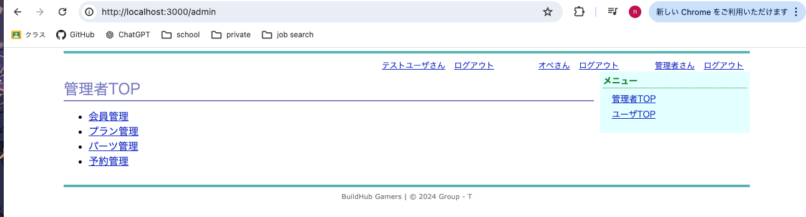

# Welcome to PC-shop Web Application 

# 技術スタック一覧
- [Docker](https://www.docker.com/ja-jp/) 仮想の実行環境作成アプリケーション
- [Ruby on Rails](https://rubyonrails.org/)　Webアプリケーションフレームワーク
- [使用教科書](https://www.oiax.jp/rails5book) 改訂4版 基礎Ruby on Rails

# 環境構築
[Docker](https://docs.docker.com/desktop/install/mac-install/)のインストールとサインインが完了している状態から始める。

<br>

### Step1 コンテナの作成
- ターミナルを開いてアプリケーション作成用のディレクトリに移動したら、以下のコマンドを用いてDocker用のディレクトリを作成、移動する。
```sh
mkdir docker
cd docker
```

- 以下の内容を以下の内容をDockerfileというファイル名でdockerディレクトリ内に保存する。

```sh
FROM ruby:3.1.3-bullseye

ENV LANG="C.UTF-8" \
    TZ="Asia/Tokyo" \
    RAILS_VERSION="7.0.4"

RUN apt-get update && apt-get install -y vim git less && rm -rf /var/lib/apt/lists/*

RUN apt-get update && apt-get install -y sqlite3 && rm -rf /var/lib/apt/lists/*

RUN apt-get update && apt-get -y install build-essential && rm -rf /var/lib/apt/lists/*

RUN gem install rails --version "$RAILS_VERSION" -N

RUN gem update bundler

RUN git config --global init.defaultBranch main

EXPOSE 3000
```
- 以下のコマンドでDockerイメージを作成し、コンテナを起動
```sh
docker build -t pc-shop:2024 .
```

```sh
docker run -p 3000:3000 -v $(pwd)/rails:/var/www -w /var/www --name rails24 -d pc-shop:2024 tail -f /dev/null
```
> `pc-shop:2024`や`rails24`は変えてもok

>dockerディレクトリ下にrailsディレクトリが作成される

> `docker ps`でコンテナが起動しているか確認できる

<br>

### Step2 コンテナへのログイン
```ssh
docker exec -it rails24 bash
```
>コマンドプロンプトが`root@<CONTAINER-ID>:/var/www#`となる。
  
>コンテナからロクアウトする場合は`exit`

>コマンドプロンプトスタイルを変更しておくとよい。  
>`echo 'export PS1="\[\e[1;33m\]rails:\w \u\[\e[m\]# "' >> ~/.bashrc`    
>`source ~/.bashrc`

<br>

### Step3 Railsの確認
コンテナにログインした状態で`rails -v`　　

Rails 7.0.4のように7系のRailsがインストールされていることを想定している。

本来であれば、railsコマンドを用いてRailsアプリケーションを作成するが、今回はリポジトリからクローンするため、省略。

　この後の作業のために、`exit`、ログアウトしておく。

<br>

### Step4 以下のリポジトリーからソースコードを取得

[GitHub Repogitory](https://github.com/ne221248/Rails-application/) `https://github.com/ne221248/Rails-application/`

コンテナからログアウトした状態で実行
```sh
cd rails
git clone git@github.com:ne221248/Rails-application.git
```

もしくは、以下のコマンドを実行してください。

```sh
cd rails
gh repo clone ne221248/Rails-application
```
<br>

### Step5 ローカル開発環境をセットアップ
Rails-appplication ディレクトリで実行

コンテナへログイン
```sh
make login
```
Rails-applicationディレクトリへ移動
```sh
cd Rails-application
```
installなどを実行
```sh
make setup
```

### Step6 アプリケーション起動

```sh
make run
```

>`http://localhost:3000`にアクセスして確認してください。


>アプリケーションを停止するには、バックグラウンド実行したため、`fg`コマンドでフォアグラウンドに移行し、Ctrl+Cキーを押す。

<br>

# How to use this application

## 動作例

### サイトへアクセス
[http://localhost:3000](http://localhost:3000)　にアクセスすると、購入できるプランの一覧が表示されます。ログイン関連は際はサイドバーからできます。


### プラン詳細を確認
プラン名をクリックすると、詳細を見ることができます。


### カートへ追加
カートに追加しようとすると、ログインを求められます。

ログイン後、カートに追加できるようになります。


>カートとUserは1対1の関係にあるので、またログインしても情報は記憶されていますし、一人に対して複数のカートが生成されることを防いでいます。

### 構成の変更
カートの内容を確認すると、編集or削除できるリンクが表示されている。

編集をクリックして好きな構成に変更する。


>planモデルにPC構成情報があり、partモデルにパーツ情報があるが、それらをつなぐ中間テーブルplan_partモデルを作成し、planモデルとpartモデルを多対多の関連付けをしているため、複数のプランで同じパーツを使えるようにしている。
>また、中間テーブルのおかげでplanの変更が容易である。
>>しかしそれだと、他のユーザにも反映される全てのプランについてパーツを変えてしまうため、新たな中間モデルconfigurationを作成してこの処理を可能にしている。

### 予約の確定
カートの詳細から予約を確定することができる。一度下のような画面に遷移する。


予約を確定したら、注文状況から詳細を確認することができる。


### その他
- 右上のユーザ名をクリックすることでログインしているユーザの情報やパスワードを変更できます。
- 予約はステータスが"予約済み"であれば削除できます。それ以外の時はユーザ側から削除できません。
- 在庫がなくなったパーツを含む構成はカートに追加できません。　何かの不具合でカートに追加できてしまっても、予約を確定する際にエラー処理を挟み、そのカートを破棄します。

<br>

## 管理者Page
[http://localhost:3000/admin_login](http://localhost:3000/admin_login) 「管理者」という名前でログインできます。パスワードは「game」です。

詳細は省きます。在庫の管理や構成の変更やユーザの管理や予約の削除をすることができます。
>名前付き空間Adminで実装



<br>

## オペレータPage
[http://localhost:3000/operator_login](http://localhost:3000/operator_login) 「オペ」という名前でログインできます。パスワードは「game」です。

オペレータは発送業者などを想定しています。予約ステータスの変更のみできます。
>名前付き空間operatorで実装


# ER図


